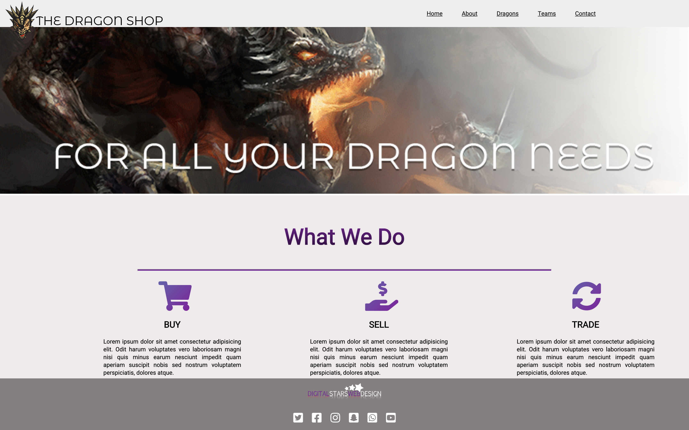
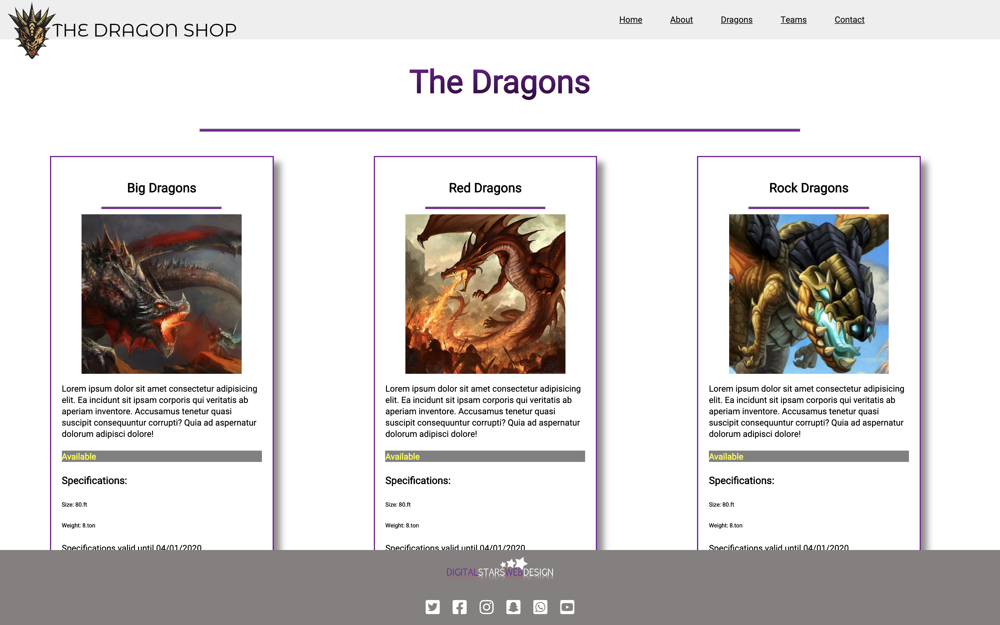

# The Dagon Store

## Description
Basic website for all your dragon needs. Scroll through and find the dragon that fits your needs

## Technology Used
html, css, git, git-hub

## Screenshots

## How to deploy
* Clone down this project

* At the root of this project run the following command `hs -o`;

* In your browser navigate to `http://localhost:8888`

# Designer
Kenny Mc
